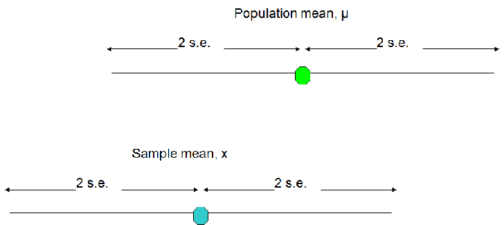

## Confidence intervals

**Point Estimation:**

 1) Provides a single value
    -Based on observations from one sample
 2) Gives no information about how close the value is to the unknown population parameter
 3) Example: Sample mean x = 3 is point estimate of unknown population mean

## Confidence intervals

**Interval estimation:**

 1) Provides a range of values
    -Based on observations from one sample
 2) Gives information about closeness to unknown population parameter
    - Stated in terms of probability
      -Knowing exact closeness requires knowing unknown population parameter

 3) Example: The range between 50 and 70 contains the true unknown parameter value with 95% confidence


## 


  - Bigger sample size, less variability in sample means: $s.e.=SD\sqrt{n}$
  - Average value of sample means is equal to the population mean
  - Sample means follow normal distribution if the distribution in the population is normal
  - and if n is large, is roughly normal even if the population is not normal
  
 
## 


***
  - If we repeated our sampling many times, 95% of sample means   would be within 2 standard errors of the population mean.
  - In practice we usually have only one sample but we   can use the sample data to quantify the uncertainty in our single estimate


## 

95% of sample means lie within 2 s.e. of the population mean
 so we can also say: 95% of the time the population mean will lie within 2 s.e. of the our sample mean



## Confidence interval on $\mu$ ($\alpha$ known) 

$$
P(-1.96 <= \frac{P(\bar{X}- \mu)}{\frac{\alpha}{\sqrt{n}}}) = 0.95
$$

$$
P(\bar{X} -1.96\frac{\alpha}{\sqrt{n}} <= \mu <= \bar{X} +1.96\frac{\alpha}{\sqrt{n}}) = 0.95
$$

$$
(\bar{X} -1.96\frac{\alpha}{\sqrt{n}}, \bar{X} +1.96\frac{\alpha}{\sqrt{n}})
$$

is a 95% confidence interval for $\mu$

##

A survey of haemoglobin status in children $<$ 5yrs in Kilifi district.
30 children gave a finger prick blood sample and the mean Hb was 9.6g/dl with a standard deviation of 1.5 g/dl.

- Sample estimate of the SD:  1.5 g/dl
- Standard error  $s.e.=SD\sqrt{n}$

```{r , echo=T,results='hide', warning=FALSE}
se <- 1.55/sqrt(30)
lower_ci <- 9.6-(2*se)
upper_ci <- 9.6+(2*se)
```
 
- Interpretation: we can say with 95% confidence that the mean Haemoglobin concentration in children in the population could be as small as `r lower_ci` or as big as `r upper_ci`  g/dl

## Slide with R Code and Output

```{r}
summary(cars)
```

## Slide with Plot

```{r, echo=FALSE}
plot(cars)
```

